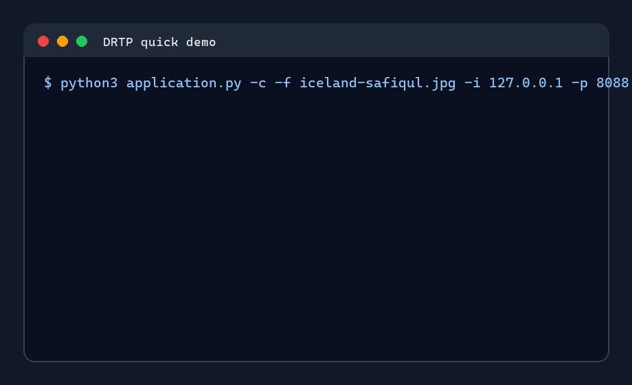
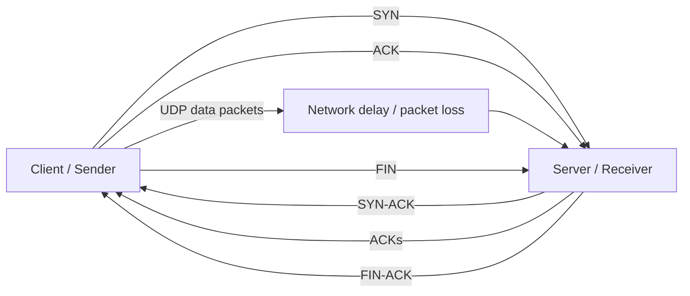

# DRTP - Reliable Transport Protocol over UDP

[](https://github.com/williamdavidsen/Reliable-Transport-Protocol-DRTP/actions/workflows/python.yml)

A Python implementation of a reliable file transfer protocol built on top of UDP.

DRTP implements connection setup, ordered delivery, acknowledgements, retransmissions, sliding windows, and connection teardown in the application layer.



## Highlights

- Reliable file transfer over UDP
- Go-Back-N with a configurable sliding window
- Custom packet header with sequence number, acknowledgement number, flags, and window size
- Packet drop option for retransmission tests
- Throughput measurements for different RTT, loss, and window-size settings

Related docs:

- [Architecture notes](docs/architecture.md)
- [Testing notes](docs/testing.md)

## Overview

The protocol sends files between a client and a server using UDP sockets. Reliability is handled by the application instead of the transport layer. The sender keeps a sliding window of unacknowledged packets, and the receiver accepts packets in order while acknowledging the latest valid sequence number.

## Features

- Reliable file transfer over UDP
- Custom DRTP packet header
- Three-way connection establishment: `SYN`, `SYN-ACK`, `ACK`
- Go-Back-N retransmission strategy
- Configurable sliding window size
- Packet discard option for retransmission testing
- Unique output filenames to avoid overwriting received files
- Timestamped client and server logs
- Client transfer summary and server throughput measurement

## Screenshots

| Client Transfer | Server Receiver |
| --- | --- |
|  |  |

## Architecture




## Project Structure

```text
.
|-- .github/
|   `-- workflows/
|       `-- python.yml
|-- README.md
|-- docs/
|   |-- architecture.md
|   |-- testing.md
|   `-- screenshots/
|       |-- architecture-flow.png
|       |-- client-transfer.png
|       |-- drtp-demo.gif
|       |-- retransmission-test.png
|       `-- server-transfer.png
`-- src/
    |-- application.py
    |-- client.py
    |-- filename_utils.py
    |-- protocol.py
    |-- server.py
    |-- simple-topo.py
    `-- iceland-safiqul.jpg
`-- tests/
    |-- test_filename_utils.py
    `-- test_protocol.py
```

## Requirements

- Python 3
- No external runtime dependencies
- Tests also use the Python standard library only
- Linux or Mininet environment for the full network simulation

The application can also be tested locally with loopback addresses. Mininet is used for delay and packet-loss experiments.

## Usage

Run the commands from the `src/` directory.

### Quick Local Demo

Terminal 1:

```bash
python3 application.py -s -i 127.0.0.1 -p 8088 --verbose
```

Terminal 2:

```bash
python3 application.py -c -f iceland-safiqul.jpg -i 127.0.0.1 -p 8088 -w 5 --verbose
```

### Start the Server

```bash
python3 application.py -s -i <server_ip> -p <port>
```

Example:

```bash
python3 application.py -s -i 10.0.1.2 -p 8088
```

To intentionally drop one packet for retransmission testing:

```bash
python3 application.py -s -i 10.0.1.2 -p 8088 -d 5
```

To choose the output filename:

```bash
python3 application.py -s -i 10.0.1.2 -p 8088 -o received.jpg
```

Add `--verbose` to either mode when you want packet-level logs.

### Mininet Demo

Run the topology from the `src/` directory:

```bash
sudo python3 simple-topo.py
```

Inside the Mininet CLI, open terminals for `h1` and `h2`:

```bash
xterm h1 h2
```

Use `h2` as the server and `h1` as the client.

### Start the Client

```bash
python3 application.py -c -f <file> -i <server_ip> -p <port> -w <window_size>
```

Example:

```bash
python3 application.py -c -f iceland-safiqul.jpg -i 10.0.1.2 -p 8088 -w 5
```

## Command-Line Options

| Option | Mode | Description |
| --- | --- | --- |
| `-s`, `--server` | Server | Starts the receiver |
| `-c`, `--client` | Client | Starts the sender |
| `-i`, `--ip` | Both | Server IP address |
| `-p`, `--port` | Both | UDP port |
| `-f`, `--file` | Client | File to transfer |
| `-w`, `--window` | Client | Sliding window size |
| `-d`, `--discard` | Server | Drops a selected packet once for testing |
| `-o`, `--output` | Server | Optional filename for the received file |
| `-v`, `--verbose` | Both | Prints packet-level logs |

## Protocol Overview

Each DRTP packet uses an 8-byte custom header followed by up to 992 bytes of data. The header contains sequence number, acknowledgement number, flags, and receiver window information.

The client first establishes a connection with a three-way handshake. During transfer, the sender uses Go-Back-N with a configurable sliding window. If an acknowledgement is not received before the timeout, the sender retransmits the unacknowledged window. The server accepts packets in order and acknowledges the latest correctly received sequence number.

## Testing


Run the automated tests:

```bash
python -m unittest discover -s tests
```

The project was tested with:

- Different window sizes: `3`, `5`, `10`, `15`, `20`, `25`
- RTT values such as `50 ms`, `100 ms`, and `200 ms`
- Intentional packet drops using the `-d` flag
- Random packet loss using `tc netem`
- MD5 checksum comparison between the original and received files

Detailed experiment notes were kept separately during development.
