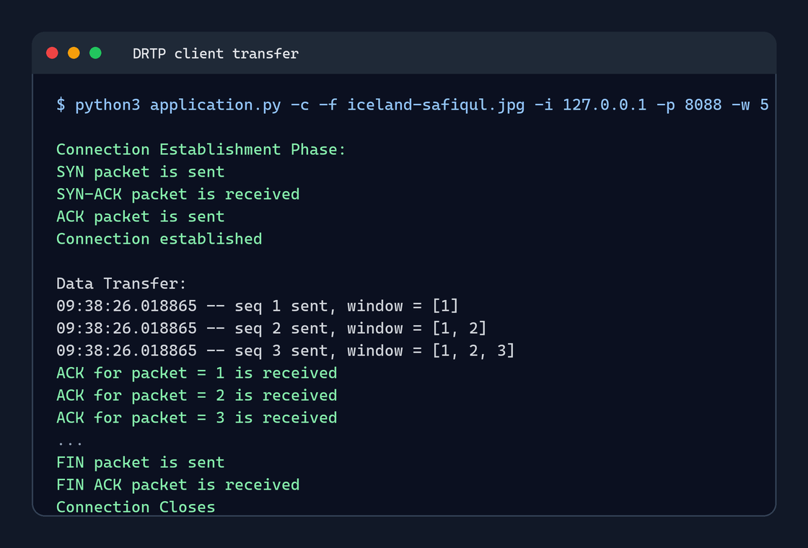
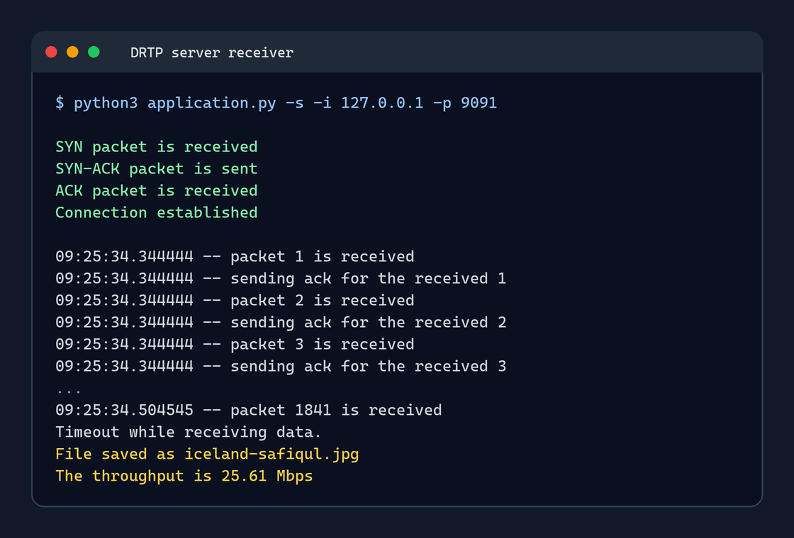
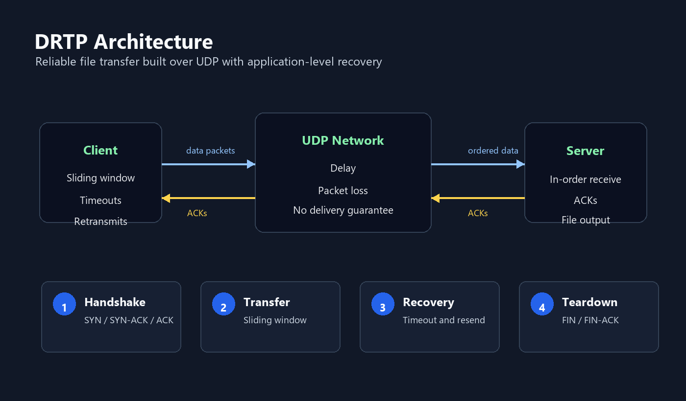
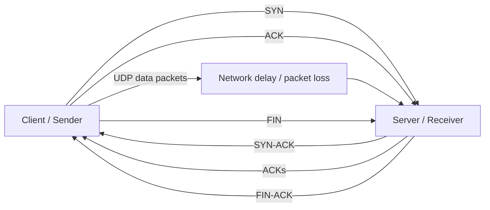
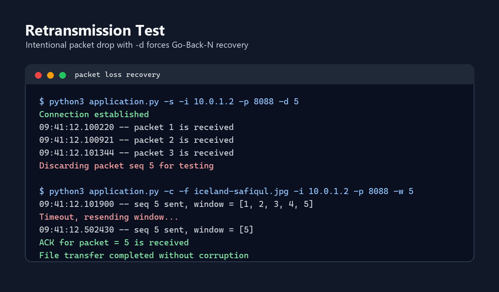

# DRTP - Reliable Transport Protocol over UDP

[](https://github.com/williamdavidsen/Reliable-Transport-Protocol-DRTP/actions/workflows/python.yml)

A Python implementation of a reliable file transfer protocol built on top of UDP.

I built this project to explore how reliable data transfer can be implemented without relying on TCP. DRTP handles connection setup, ordered delivery, acknowledgements, retransmissions, sliding windows, and connection teardown at the application layer.

## Technical Highlights

- Built reliable file transfer over UDP without using TCP reliability.
- Implemented Go-Back-N with a configurable sliding window.
- Added custom packet headers with sequence numbers, acknowledgements, flags, and window size.
- Tested retransmission behavior with intentional packet drops.
- Measured throughput under different RTT, packet loss, and window-size conditions.

More detail:

- [Architecture notes](docs/architecture.md)
- [Testing notes](docs/testing.md)

## Purpose

The goal of this project was to understand what TCP-like reliability actually requires under the hood. Instead of depending on TCP, I built the reliability mechanisms myself over UDP and tested how the protocol behaves under delay, packet loss, different window sizes, and forced retransmission scenarios.

## What I Learned

- How reliable transport can be built on top of an unreliable protocol like UDP.
- How three-way handshakes, acknowledgements, and teardown logic work in practice.
- How Go-Back-N and sliding windows affect throughput.
- How packet loss, RTT, and retransmission timeouts influence performance.
- How to validate file integrity with checksum comparison after transfer.
- How to test network behavior using Mininet and `tc netem`.

## Features

- Reliable file transfer over UDP
- Custom DRTP packet header
- Three-way connection establishment: `SYN`, `SYN-ACK`, `ACK`
- Go-Back-N retransmission strategy
- Configurable sliding window size
- Packet discard option for retransmission testing
- Unique output filenames to avoid overwriting received files
- Timestamped client and server logs
- Client transfer summary and server throughput measurement

## Screenshots

| Client Transfer | Server Receiver |
| --- | --- |
|  |  |

## Architecture





## Project Structure

```text
.
|-- .github/
|   `-- workflows/
|       `-- python.yml
|-- README.md
|-- docs/
|   |-- architecture.md
|   |-- testing.md
|   `-- screenshots/
|       |-- architecture-flow.png
|       |-- client-transfer.png
|       |-- retransmission-test.png
|       `-- server-transfer.png
`-- src/
    |-- application.py
    |-- client.py
    |-- filename_utils.py
    |-- protocol.py
    |-- server.py
    |-- simple-topo.py
    `-- iceland-safiqul.jpg
`-- tests/
    |-- test_filename_utils.py
    `-- test_protocol.py
```

## Requirements

- Python 3
- Standard Python library only
- Linux or Mininet environment for the full network simulation

The application can also be tested locally with loopback addresses, but the intended evaluation environment is Mininet.

## Usage

Run the commands from the `src/` directory.

### Quick Local Demo

Terminal 1:

```bash
python3 application.py -s -i 127.0.0.1 -p 8088
```

Terminal 2:

```bash
python3 application.py -c -f iceland-safiqul.jpg -i 127.0.0.1 -p 8088 -w 5
```

### Start the Server

```bash
python3 application.py -s -i <server_ip> -p <port>
```

Example:

```bash
python3 application.py -s -i 10.0.1.2 -p 8088
```

To intentionally drop one packet for retransmission testing:

```bash
python3 application.py -s -i 10.0.1.2 -p 8088 -d 5
```

To choose the output filename:

```bash
python3 application.py -s -i 10.0.1.2 -p 8088 -o received.jpg
```

### Start the Client

```bash
python3 application.py -c -f <file> -i <server_ip> -p <port> -w <window_size>
```

Example:

```bash
python3 application.py -c -f iceland-safiqul.jpg -i 10.0.1.2 -p 8088 -w 5
```

## Command-Line Options

| Option | Mode | Description |
| --- | --- | --- |
| `-s`, `--server` | Server | Starts the receiver |
| `-c`, `--client` | Client | Starts the sender |
| `-i`, `--ip` | Both | Server IP address |
| `-p`, `--port` | Both | UDP port |
| `-f`, `--file` | Client | File to transfer |
| `-w`, `--window` | Client | Sliding window size |
| `-d`, `--discard` | Server | Drops a selected packet once for testing |
| `-o`, `--output` | Server | Optional filename for the received file |

## Protocol Overview

Each DRTP packet uses an 8-byte custom header followed by up to 992 bytes of data. The header contains sequence number, acknowledgement number, flags, and receiver window information.

The client first establishes a connection with a three-way handshake. During transfer, the sender uses Go-Back-N with a configurable sliding window. If an acknowledgement is not received before the timeout, the sender retransmits the unacknowledged window. The server accepts packets in order and acknowledges the latest correctly received sequence number.

## Testing



Run the automated tests:

```bash
python -m unittest discover -s tests
```

The project was tested with:

- Different window sizes: `3`, `5`, `10`, `15`, `20`, `25`
- RTT values such as `50 ms`, `100 ms`, and `200 ms`
- Intentional packet drops using the `-d` flag
- Random packet loss using `tc netem`
- MD5 checksum comparison between the original and received files

The detailed experiment results were documented separately during development.
