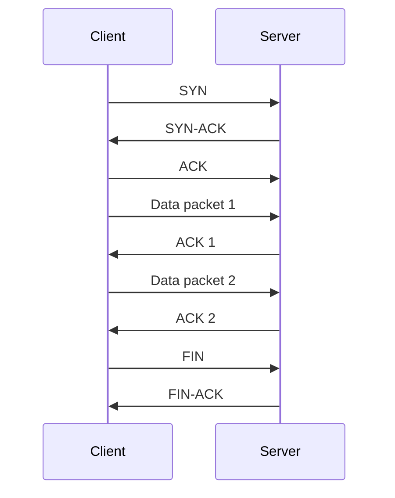

# Architecture

DRTP is a client-server file transfer application built on top of UDP. The transport logic lives in the application layer.

## Components

| Component | Responsibility |
| --- | --- |
| `application.py` | Parses command-line arguments and starts client or server mode. |
| `client.py` | Sends files, manages the sliding window, waits for ACKs, and retransmits on timeout. |
| `server.py` | Receives packets in order, writes the output file, sends ACKs, and reports throughput. |
| `protocol.py` | Defines packet constants and header packing/unpacking helpers. |
| `filename_utils.py` | Creates unique filenames so received files are not overwritten. |
| `simple-topo.py` | Defines the Mininet topology used for delay and packet-loss tests. |

## Packet Flow

## Reliability Model

The protocol uses Go-Back-N. The client sends multiple packets within the active window and moves the window forward when acknowledgements arrive. If an ACK is not received before the timeout, the client retransmits from the current base.

The server only accepts the next expected sequence number. Out-of-order packets are ignored, and the server keeps acknowledging the latest correctly received packet.
